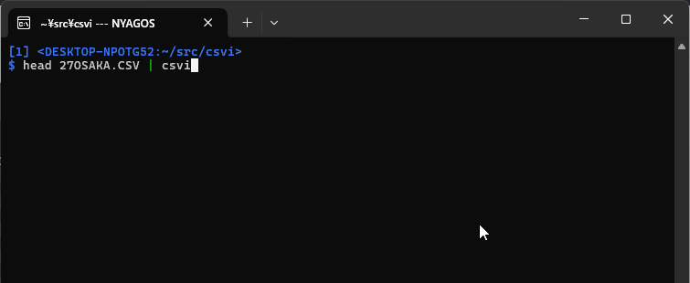

Csvi - A terminal CSV editor 
============================

<!-- go run github.com/hymkor/example-into-readme/cmd/badges@master | -->
[](https://github.com/hymkor/csvi/actions/workflows/go.yml)
[](https://github.com/hymkor/csvi/blob/master/LICENSE)
[](https://pkg.go.dev/github.com/hymkor/csvi)
<!-- -->

( **\<English\>** / [\<Japanese\>](./README_ja.md) )

**Csvi** is a terminal-based CSV editor for UNIX-like systems and Windows.

## Key Features

- **Minimal changes on save**  
  Csvi keeps the original formatting for every unmodified cell: quotes, line endings (LF/CRLF), BOM, encoding, and field/record separators.  
  Only actual edits are saved—making it ideal for clean diffs and safe edits to production data.

- **vi-style and Emacs-style keybindings**  
  Move the cursor like in vi, and edit cells using Emacs-style key bindings.  
  (Since v1.21.1, `Ctrl-G` is used instead of `Esc` to cancel cell editing.)

- **Reads from both file and standard input**  
  You can pipe CSV data into Csvi or open a file directly.

- **Fast startup and background loading**  
  Opens large files quickly without blocking the interface.

- **Visual feedback for edits**  
  Modified cells are underlined.  
  Press `u` to undo a cell's change and restore its original value.

- **Shows original format details**  
  The bottom line of the screen shows technical info: quoting, encoding, field separators, and more—just as they appeared in the original file.

- **Flexible encoding support**  
  - UTF-8 (default)  
  - UTF-16  
  - Current Windows code page (auto-detected)  
  - Any encoding from the [IANA registry] using `-iana NAME`

- **Color scheme options**
  - Default colors assume a dark background.
  - Use `-rv` for light backgrounds, or set `NO_COLOR` to disable color output (https://no-color.org/ )

[IANA registry]: http://www.iana.org/assignments/character-sets/character-sets.xhtml



[Video](https://www.youtube.com/watch?v=_cxBQKpfUds) by [@emisjerry](https://github.com/emisjerry)

Install
-------

### Manual Installation

Download the binary package from [Releases](https://github.com/hymkor/csvi/releases) and extract the executable.

> &#9888;&#65039; Note: The macOS build is experimental and not yet tested.
> Please let us know if you encounter any issues!

<!-- go run github.com/hymkor/example-into-readme/cmd/how2install@master | -->

### Use [eget] installer (cross-platform)

```sh
brew install eget        # Unix-like systems
# or
scoop install eget       # Windows

cd (YOUR-BIN-DIRECTORY)
eget hymkor/csvi
```

[eget]: https://github.com/zyedidia/eget

### Use [scoop]-installer (Windows only)

```
scoop install https://raw.githubusercontent.com/hymkor/csvi/master/csvi.json
```

or

```
scoop bucket add hymkor https://github.com/hymkor/scoop-bucket
scoop install csvi
```

[scoop]: https://scoop.sh/

### Use "go install" (requires Go toolchain)

```
go install github.com/hymkor/csvi/cmd/csvi@latest
```

Note: `go install` places the executable in `$HOME/go/bin` or `$GOPATH/bin`, so you need to add this directory to your `$PATH` to run `csvi`.
<!-- -->

Usage
-----

```
$ csvi {options} FILENAME(...)
```

or

```
$ cat FILENAME | csvi {options}
```

Note: When reading from standard input, saving commands like `w` write to `-` (standard output) by default.

Options

* `-help` this help
* `-h int` the number of fixed header lines
* `-c` use Comma as field-separator (default when suffix is `.csv`)
* `-t` use TAB as field-separator (default when suffix is not `.csv`)
* `-semicolon` use Semicolon as field-separator
* `-iana string` [IANA-registered-name] to decode/encode NonUTF8 text
* `-16be` Force read/write as UTF-16BE
* `-16le` Force read/write as UTF-16LE
* `-auto string` auto pilot (for testcode)
* `-nonutf8` do not judge as UTF-8
* `-w widths` set the widths of cells (e.g., `-w 14,0:10,1:20` to set the first column to 10 characters wide, the second column to 20 characters wide, and all others to 14 characters wide)
* `-fixcol` forbid insertion or deletion of cells (disables `i`, `a`, and some of `d`-prefixed deletion commands)
* `-p` Protect the header line
* `-readonly` Read Only Mode
* `-rv` Enable reverse-video display (invert foreground and background colors)
* `-ofs string` String used as the separator between cells in the output
* `-exteditor string` External editor used with `Shift`+`R`
* `-o filename` preset output filename in the save prompt (used with standard input)
* `-delimiter string` Specify the field separator
* `-version` Print version and exit

[IANA-registered-name]: https://www.iana.org/assignments/character-sets/character-sets.xhtml

Key-binding
-----------

* Move Cursor
    * `h`, `←`, `Shift`+`TAB` (move cursor left)
    * `j`, `Ctrl`+`N`, `↓`, `Enter` (move cursor down)
    * `k`, `Ctrl`+`P`, `↑` (move cursor up)
    * `l`, `→`, `TAB` (move cursor right)
    * `<`, `gg` (move to the beginning of file)
    * `>`,`G` (move to the end of file)
    * `0`, `^`, `Ctrl`+`A` (move to the beginning of the current line)
    * `$`,`Ctrl`+`E` (move to the end of the current line)
    * `PgUp`, `Ctrl`+`B` (move up one page)
    * `PgDn`, `Ctrl`+`F` (move down one page)
* Search
    * `/` (search forward for a partial match)
    * `?` (search backward for a partial match)
    * `n` (repeat the previous search forward)
    * `N` (repeat the previous search backward)
    * `*` (search forward for the next cell that exactly matches the current one)
    * `#` (search backward for the previous cell that exactly matches the current one)
* Edit
    * `i` (insert a new cell before the current one)
    * `a` (append a new cell after the current one)
    * `r`,`Meta`+`F2` (replace the current cell with the built-in readline)
    * `R` (replace the current cell with the external editor)
    * `x` (clear the current cell)
    * `dl`, `d`+`SPACE`, `d`+`TAB`, `dv` (delete cell and shift cells on the right)
    * `dd`, `dr` (delete the current line)
    * `dc`, `d|` (delete the current column)
    * `w` (write to a file or STDOUT(`'-'`))
    * `o` (append a new line after the current one)
    * `O` (insert a new line before the current one)
    * `"` (enclose or remove double quotations if possible)
    * `u` (restore the original value of the current cell)
    * `yl`, `y`+`SPACE`, `y`+`TAB`, `yv` (copy the values of the current cell to kill-buffer)
    * `yy`, `yr`, `Y` (copy the values of the current row to kill-buffer)
    * `yc`, `y|` (copy the values of the current column to kill-buffer)
    * `p` (paste the values of kill-buffer after the current cell, row or column)
    * `P` (paste the values of kill-buffer before the current cell, row or column)
    * `Meta`+`p` (overwrite the current cell/row/column with the content of the kill-buffer)
* Display settings
    * `L` (reload the file using a specified encoding)
    * `Ctrl`+`L` (Repaint)
    * `]` (widen the column at the cursor)
    * `[` (narrow the column at the cursor)
* Quit: `q` or `Meta`+`q`

`Meta` means either `Alt`+`key` or `Esc` followed by key.

Environment Variables
---------------------

### NO\_COLOR

If the environment variable `NO_COLOR` is set to any value with at least one character,
Csvi disables colored output.
This follows the standard proposed by [NO\_COLOR](https://no-color.org).

### RUNEWIDTH\_EASTASIAN

Specifies the display width for Unicode characters classified as ambiguous width.

* Double-width: `set RUNEWIDTH_EASTASIAN=1`
* Single-width: `set RUNEWIDTH_EASTASIAN=0` (any non-`1` value with at least one character is also valid)

### COLORFGBG

When the environment variable is defined in the form `(FG);(BG)` and the foreground `(FG)` is less than the background `(BG)`,
Csvi automatically uses color settings suitable for light backgrounds (equivalent to the `-rv` option).

Csvi normally uses the terminal's default colors via the escape sequences `ESC[39m` and `ESC[49m`.
Thus, the `(FG);(BG)` values are **not** directly applied; they are only used to determine whether gray background lines should be adjusted toward light or dark shades.

### GOREADLINESKK

When the environment variable `GOREADLINESKK` specifies dictionary files,
the built-in SKK[^SKK] Kana-to-Kanji conversion via [go-readline-skk] is enabled.

* **Windows**

  * `set GOREADLINESKK=SYSTEMJISYOPATH1;SYSTEMJISYOPATH2...;user=USERJISYOPATH`
  * Example:
    `set GOREADLINESKK=~/Share/Etc/SKK-JISYO.L;~/Share/Etc/SKK-JISYO.emoji;user=~/.go-skk-jisyo`
* **Linux**

  * `export GOREADLINESKK=SYSTEMJISYOPATH1:SYSTEMJISYOPATH2...:user=USERJISYOPATH`

(Note: `~` is automatically expanded to `%USERPROFILE%` on Windows, even in `cmd.exe`.)

[^SKK]: Simple Kana to Kanji conversion program. One of the Japanese input method editors.

[go-readline-skk]: https://github.com/nyaosorg/go-readline-skk

Use as a Go package
-------------------

```examples/example.go
package main

import (
    "fmt"
    "os"
    "strings"

    "github.com/mattn/go-colorable"

    "github.com/hymkor/csvi"
    "github.com/hymkor/csvi/uncsv"
)

func main() {
    source := `A,B,C,D
"A1","B1","C1","D1"
"A2","B2","C2","D2"`

    cfg := &csvi.Config{
        Mode: &uncsv.Mode{Comma: ','},
    }

    result, err := cfg.Edit(strings.NewReader(source), colorable.NewColorableStdout())

    if err != nil {
        fmt.Fprintln(os.Stderr, err.Error())
        os.Exit(1)
    }

    // // env GOEXPERIMENT=rangefunc go run example
    // for row := range result.Each {
    //     os.Stdout.Write(row.Rebuild(cfg.Mode))
    // }
    result.Each(func(row *uncsv.Row) bool {
        os.Stdout.Write(row.Rebuild(cfg.Mode))
        return true
    })
}
```

Release Note
------------

- [English](./release_note_en.md)
- [Japanese](./release_note_ja.md)

Acknowledgements
----------------

- [sergeevabc (Aleksandr Sergeev)](https://github.com/sergeevabc)
- [kevin-gwyrdh (Kevin)](https://github.com/kevin-gwyrdh)
- [emisjerry (emisjerry)](https://github.com/emisjerry)
- [rinodrops (Rino)](https://github.com/rinodrops)
- [toolleeo](https://github.com/toolleeo)
- [wumfi](https://github.com/wumfi)
- [presianbg (Presian Yankulov)](https://github.com/presianbg)
- [gsmitheidw (Graham Smith)](https://github.com/gsmitheidw)

Author
------

- [hymkor (HAYAMA Kaoru)](https://github.com/hymkor)
