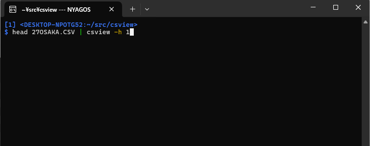

The unbreakable CSV editor "CSView"
===================================
[](https://pkg.go.dev/github.com/hymkor/csview)

**&lt;English&gt;** / [&lt;Japanese&gt;](./README_ja.md)

CSView is the CSV editor that runs on the terminal of Linux and Windows.
Here are some key features:

- Keybinding: vi-like on moving cursor and Emacs-like on editing cell
- It reads the data from both file and standard-input
- Modified cells are displayed with underline
    - With one key `u`, original value before modifying can be restored
- Non-user-modified cells retain their original values
    - Enclosing double quotations or not of the cell value that contains neither commas nor line breaks
    - LF or CRLF for line breaks
    - BOM of the beginning of files
    - The representation before decoding double quotations, encoding, field and record sperators and so on are displayed on the bottom line
- CSView supports the following encodings:
    - UTF8 (default)
    - Current codepage on Windows (automatically detected)
    - Encodings specified by the [IANA registry] (-iana NAME)

[IANA registry]: http://www.iana.org/assignments/character-sets/character-sets.xhtml



Install
-------

### Manual Installation

Download the binary package from [Releases](https://github.com/hymkor/csview/releases) and extract the executable.

### Use "go install"

```
env GOEXPERIMENT=rangefunc go install github.com/hymkor/csview@latest
```

### Use scoop-installer

```
scoop install https://raw.githubusercontent.com/hymkor/csview/master/csview.json
```

or

```
scoop bucket add hymkor https://github.com/hymkor/scoop-bucket
scoop install csview
```

Usage
-----

```
$ csview {options} FILENAME(...)
```

or

```
$ cat FILENAME | csview {options}
```

Options

* `-h int` -  the number of fixed header lines
* `-c` - use Comma as field-separator (default when suffix is `.csv`)
* `-t` - use TAB as field-separator (default when suffix is not `.csv`)
* `-iana string` - [IANA-registered-name] to decode/encode NonUTF8 text

[IANA-registered-name]: https://www.iana.org/assignments/character-sets/character-sets.xhtml

Key-binding
-----------

* Move Cursor
    * `h`,`Ctrl`-`B`,`←`,`Shift`-`TAB` (move cursor left)
    * `j`,`Ctrl`-`N`,`↓`,`Enter` (move cursor down)
    * `k`,`Ctrl`-`P`,`↑` (move cursor up)
    * `l`,`Ctrl`-`F`,`←`,`TAB` (move cursor right)
    * `<` (move the beginning of file)
    * `>`,`G` (move the end of file)
    * `0`,`^`,`Ctrl`-`A` (move the beginning of the current line)
    * `$`,`Ctrl`-`E` (move the end of the current line)
* Search
    * `/` (search forward)
    * `?` (search backward)
    * `n` (search next)
    * `N` (search next reverse)
* Edit
    * `i` (insert a new cell before the current one)
    * `a` (append a new cell after the current one)
    * `r` (replace the current cell)
    * `d`,`x` (delete the current cell)
    * `w` (write to a file or STDOUT(`'-'`))
    * `o` (append a new line after the current one)
    * `O` (insert a new line before the current one)
    * `D` (delete the current line)
    * `"` (enclose or remove double quotations if possible)
    * `u` (restore the original value of the current cell)
    * `y` (copy the value of the current cell to kill-buffer)
    * `p` (paste the value of kill-buffer to the current cell)
* Repaint: `Ctrl`-`L`
* Quit: `q` or `ESC`

Readline with SKK[^SKK]
-----------------------

When the environment variable GOREADLINESKK is defined, [go-readline-skk] is used.

- Windows
    - `set GOREADLINESKK=SYSTEMJISYOPATH1;SYSTEMJISYOPATH2...;user=USERJISYOPATH`
    - (example) `set GOREADLINESKK=~/Share/Etc/SKK-JISYO.L;~/Share/Etc/SKK-JISYO.emoji;user=~/.go-skk-jisyo`
- Linux
    - `export GOREADLINE=SYSTEMJISYOPATH1:SYSTEMJISYOPATH2...:user=USERJISYOPATH`

[^SKK]: Simple Kana to Kanji conversion program. One of the Japanese input method editor.

[go-readline-skk]: https://github.com/nyaosorg/go-readline-skk

Release Note
------------

- [English](./release_note_en.md)
- [Japanese](./release_note_ja.md)
