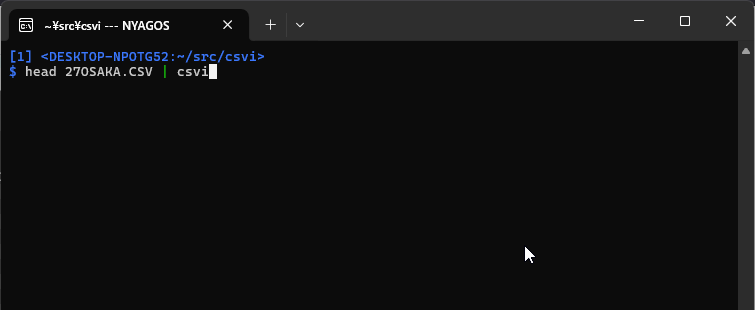

"CSVI" - Terminal CSV Editor
============================
[](https://pkg.go.dev/github.com/hymkor/csvi)

[&lt;English&gt;](./README.md) / **&lt;Japanese&gt;**

- *同分野に同名の製品が比較的多いため、1.6.0 より CSView は CSVI に改名しました。*

CSVI はLinux やWindows のターミナル用の CSV エディタです。
次のような特徴があります。

- セル選択は vi 風、セル編集は Emacs 風のキー操作
- ファイル / 標準入力両方からの読み取りに対応
- すばやく起動し、データをバックグランドで読み込み
- 修正されたセルには下線を表示
    - １キー(`u`) でセルを加筆前の状態に戻すことが可能
- ユーザが修正していないセルは極力元々の表現を維持するようにする
    - 改行やカンマを含まないセルでの、二重引用符の有無
    - 各行ごとに LF と CRLF の違い
    - ファイルの先頭に BOM の有無
    - 二重引用符などをデコードする前の表現、文字コード、改行コード、区切り文字などを最下行に表示
- 様々な文字コードをサポート
    - UTF8 (default)
    - UTF16
    - Windows のコードページ (自動判別)
    - [IANA registry] (-iana NAME) で指定されるエンコーディング

[IANA registry]: http://www.iana.org/assignments/character-sets/character-sets.xhtml



Install
-------

### Manual Installation

[Releases](https://github.com/hymkor/csvi/releases) よりバイナリパッケージをダウンロードして、実行ファイルを展開してください

### "go install" を使う場合

```
go install github.com/hymkor/csvi@latest
```

### scoop インストーラーを使う場合

```
scoop install https://raw.githubusercontent.com/hymkor/csvi/master/csvi.json
```

もしくは

```
scoop bucket add hymkor https://github.com/hymkor/scoop-bucket
scoop install csvi
```

Usage
-----

```
$ csvi {options} FILENAME(...)
```

or

```
$ cat FILENAME | csvi {options}
```

Options

* `-help` 本ヘルプを表示
* `-h int` ヘッダ行の行数
* `-c` 列区切りにカンマを使う(拡張子が `.csv` の時のデフォルト動作)
* `-t` 列区切りにタブを使う(拡張子が `.csv` でない時のデフォルト動作)
* `-semicolon` 区切りにセミコロンを使う
* `-iana string` 非UTF8テキストを読み書きする時の [IANA名] を指定する
* `-16be` UTF-16BE と判断する
* `-16le` UTF-16LE と判断する
* `-auto string` 自動処理 (テストコード用)
* `-nonutf8` UTF-8 と判断しない
* `-w uint` セルを幅を設定 (default 14)

[IANA名]: https://www.iana.org/assignments/character-sets/character-sets.xhtml

キーバインド
-----------

* カーソル移動
    * `h`,`Ctrl`-`B`,`←`,`Shift`-`TAB` (左)
    * `j`,`Ctrl`-`N`,`↓`,`Enter` (下)
    * `k`,`Ctrl`-`P`,`↑` (上)
    * `l`,`Ctrl`-`F`,`←`,`TAB` (右)
    * `<` (ファイル先頭)
    * `>`,`G` (ファイル末尾)
    * `0`,`^`,`Ctrl`-`A` (行頭)
    * `$`,`Ctrl`-`E` (行末)
* 検索
    * `/` (前方検索)
    * `?` (後方検索)
    * `n` (次検索)
    * `N` (逆検索)
* 編集
    * `i` (現在のセルの前に新セルを挿入)
    * `a` (現在のセルの右に新セルを挿入)
    * `r` (現在のセルを置換)
    * `d`,`x` (現在のセルを削除)
    * `w` (ファイルもしくは標準出力(`'-'`)に出力する)
    * `o` (現在の行の後に新しい行を追加する)
    * `O` (現在の行の前に新しい行を挿入する)
    * `D` (現在の行を削除する)
    * `"` (可能であれば、二重引用符の囲む/外す)
    * `u` (現在のセルの元の値を復元する)
    * `y` (現在のセルの値を内部クリップボードへコピー)
    * `p` (現在のセルに内部クリップボードの値をペースト)
* 再表示: `Ctrl`-`L`
* 終了: `q` or `ESC`

Readline with SKK[^SKK]
-----------------------

環境変数 GOREADLINESKK に次のように辞書ファイルが指定されている時、[go-readline-skk] を使った内蔵SKKが使用できます

- Windows
    - `set GOREADLINESKK=SYSTEMJISYOPATH1;SYSTEMJISYOPATH2...;user=USERJISYOPATH`
    - (example) `set GOREADLINESKK=~/Share/Etc/SKK-JISYO.L;~/Share/Etc/SKK-JISYO.emoji;user=~/.go-skk-jisyo`
- Linux
    - `export GOREADLINE=SYSTEMJISYOPATH1:SYSTEMJISYOPATH2...:user=USERJISYOPATH`

[^SKK]: Simple Kana to Kanji conversion program. One of the Japanese input method editor.

[go-readline-skk]: https://github.com/nyaosorg/go-readline-skk

Release Note
------------

- [English](./release_note_en.md)
- [Japanese](./release_note_ja.md)
