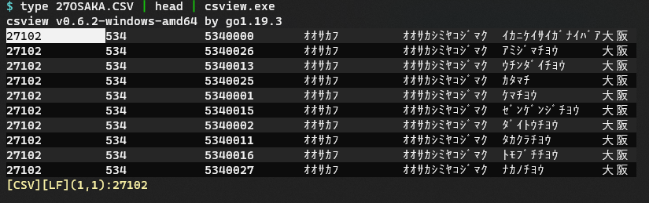

csview - simple csv viewer/editor
=================================



```
$ csview FILENAME(...)
```

or

```
$ csview < FILENAME
```

* Support OS:
    * Windows & Linux (tested on WSL)
* Charactor code:
    * Windows: UTF8 or Current Code Page
    * Linux: UTF8
* Key-binding:
    * Move Cursor
        * `h`,`Ctrl`-`B`,&#x2190; (move cursor left)
        * `j`,`Ctrl`-`N`,&#x2193; (move cursor down)
        * `k`,`Ctrl`-`P`,&#x2191; (move cursor up)
        * `l`,`Ctrl`-`F`,&#x2192; (move cursor right)
    * Search
        * `/` (search forward)
        * `?` (search backward)
        * `n` (search next)
        * `N` (search next reverse)
    * Edit
        * `i` (insert the new cell before the current one)
        * `a` (append the new cell after the current one)
        * `r` (replace the current cell)
        * `d` (delete the current cell)
        * `w` (write to the file)
    * Quit: "q" or ESC
* Option
    * -c ... use Comma as field-separator (default when suffix is `.csv`)
    * -t ... use TAB as field-separator (default when suffix is not `.csv`)
